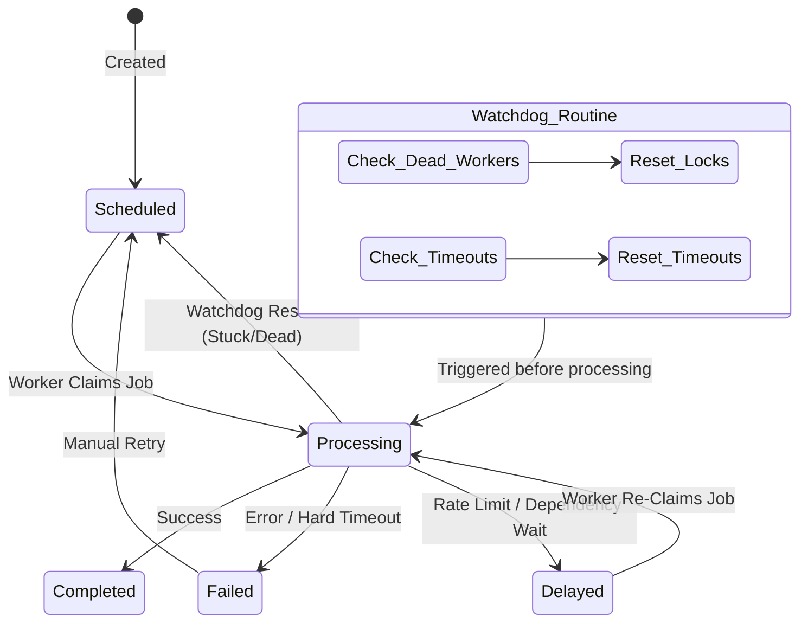

# Jobs Resilience & Handling

This document provides a comprehensive overview of the APIs Hub worker resilience system, designed to handle stuck jobs, graceful shutdowns, and manual intervention when necessary.

## The Job Lifecycle

The job state machine uses the following linear progression, managed through the database:

1. **Scheduled (`1`)**: A job is created and awaits processing.
2. **Processing (`2`)**: A worker has claimed the job and is actively executing it.
3. **Completed (`3`)**: The job finished successfully.
4. **Failed (`4`)**: The job encountered a fatal error.
5. **Delayed (`5`)**: The job hit a rate limit or dependency block and will be retried later.
6. **Cancelled (`6`)**: The job was manually cancelled or aborted and will not be processed.

### Automated Workflow Diagram

## Automatic Recovery (The Watchdog)

The system includes automatic mechanisms to prevent jobs from being permanently stuck in the `Processing` state due to worker crashes or sudden terminations.

### Master Instance Duties

The designated `master` instance runs a watchdog routine:

- **Dead Worker Detection**: It queries the local Docker socket to identify running containers. If it finds jobs assigned to workers that no longer exist, it immediately resets them to `Scheduled`.
- **Orphaned Job Cleanup**: If a job has been stuck in `Processing` for over 120 minutes (configurable threshold), it's considered orphaned and safely reset to `Scheduled` with a cleared `workerId` lock.

### Graceful Shutdowns

Workers listening for `SIGTERM` or `SIGINT` signals (e.g., during a deployment or container restart) will immediately flag themselves to shut down, cleanly abandon the queue loop after their active job finishes, and exit cleanly. Docker is configured with a 60-minute grace period (`stop_grace_period`) to accommodate long-running synchronizations.

## Manual Intervention (CLI Commands)

When automatic recovery isn't enough or you need specialized queue insight, use the following interactive commands inside the container:

### 1. `app:process-jobs`

The master worker daemon. It claims and executes jobs continuously.

- **Usage**: `php bin/cli.php app:process-jobs [--force-all] [--job-id=<id>]`
- **Use Case**: Runs automatically in containers, but can be triggered manually to process the queue or force a single job id.

### 2. `app:schedule-initial-jobs`

Scans the `project.yaml` instance configurations and injects initial synchronization jobs for any active channels that do not already have jobs.

- **Usage**: `php bin/cli.php app:schedule-initial-jobs`
- **Use Case**: Run this after adding new integration channels to the project to instantly kickstart data fetching.

### 3. `app:jobs-stats`

Provides a detailed visual statistical breakdown of the current job queue.

- **Usage**: `php bin/cli.php app:jobs-stats`
- **Use Case**: Use this to monitor queue health, see how many jobs have failed in the last 24 hours, and see the exact breakdown by channel (e.g., Facebook vs Google).

### 4. `app:jobs:reset`

**The "Big Red Button"**
Manually triggers the orphaned job rescheduling logic without waiting for the automated watchdog.

- **Usage**: `php bin/cli.php app:jobs:reset [--threshold=120]`
- **Use Case**: If you suspect a deployment crash left jobs hanging in `processing` status, run this to instantly clear their worker locks and push them back into the `scheduled` pool.

### 5. `app:jobs:retry-failed`

Granular, surgical retry for a specific failed job.

- **Usage**: `php bin/cli.php app:jobs:retry-failed <job_id>`
- **Use Case**: If a specific job failed due to a temporary API timeout that you know is resolved, run this to copy its payload into a brand new job and schedule it for immediate execution.

### 6. `app:jobs-retry`

Bulk retry for all failed jobs in the queue.

- **Usage**: `php bin/cli.php app:jobs-retry [--channel=<channel_name>]`
- **Use Case**: If a specific integration (e.g., `facebook`) went offline and caused 500 jobs to fail, run `app:jobs-retry --channel=facebook` to sweep them all back to `scheduled` at once.

## Human-Aimed Tutorials

### Scenario A: A massive API outage caused 1,000 jobs to fail

1. Run `php bin/cli.php app:jobs-stats` to confirm exactly which channel is bleeding failed jobs.
2. Once the API provider resolves their outage, you do not need to retry them one by one.
3. Run `php bin/cli.php app:jobs-retry --channel=the_failing_channel` to bulk-reschedule them. The workers will automatically pick them up on their next cycle.

### Scenario B: I restarted my Docker containers forcefully and the queue stopped moving

1. Forceful restarts (like `kill -9` or a server crash) bypass the Graceful Shutdown listener, leaving jobs permanently stamped with `processing` and locked to dead `workerId`s.
2. Run `php bin/cli.php app:jobs:reset -t 10`.
3. This "Big Red Button" manually forces the Watchdog to sweep the database, detach the dead worker locks, and revert the jobs to `scheduled`.

### Scenario C: I just deployed a brand new integration to `project.yaml`

1. The integration is deployed, but the queue is empty.
2. Run `php bin/cli.php app:schedule-initial-jobs`.
3. This command safely detects the new instances and automatically seeds the queue with the necessary start jobs.

### Scenario D: I need to gracefully restart a specific worker

1. Run `docker stop <container_name>`.
2. Do **not** use `docker kill`. The `stop` command sends a `SIGTERM` signal.
3. The `ProcessJobsCommand` will catch this signal, flip its internal `shouldShutdown` flag, finish its current API sync cleanly, and then exit automatically.
