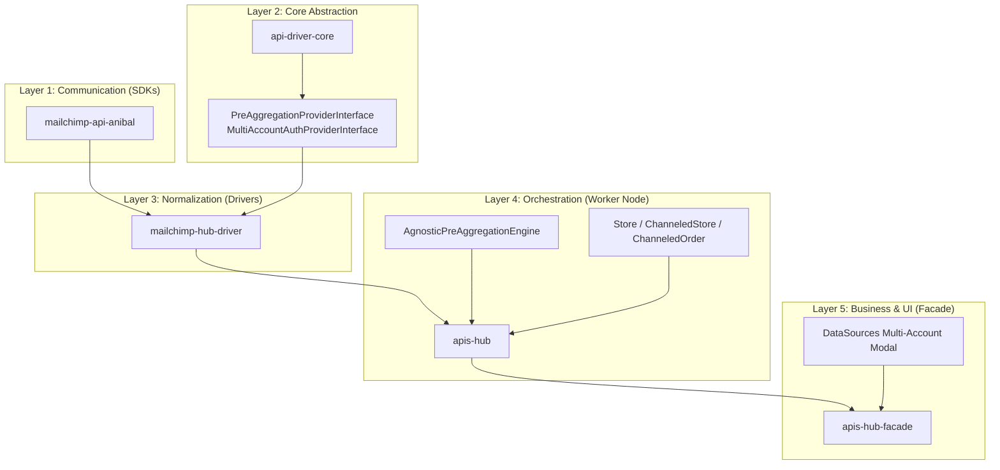

# APIs Hub SaaS v1.17.0 Master Implementation Plan
## Theme: Email Marketing Domain, Agnostic Pre-Aggregation, and Multi-Account Authentication

**Release Version:** `v1.17.0`  
**Target Date:** Q3/Q4 2026  
**Status:** In Progress (Tracking Master Roadmap)  
**Parent Workspace:** `d:\laragon\www\`

---

## 1. Release Overview & Strategic Objectives

The `v1.17.0` release introduces the **Email Marketing Domain**, **Agnostic Pre-Aggregation Engine**, and **Multi-Account Credential Architecture** to APIs Hub SaaS.

Historically, APIs Hub operated primarily on channels providing native pre-aggregated daily summaries (Google Search Console, Google Analytics, Meta Ads, Facebook Organic). With `v1.17.0`, APIs Hub expands into **atomic event ingestion and cross-domain attribution** (Mailchimp, followed by Klaviyo and Shopify multi-store), enabling:
1. **Atomic Event Ingestion:** Continuous capture of recipient-level email activity (opens, clicks, bounces, unsubscribes) and transactional store orders.
2. **Agnostic 1-Day Pre-Aggregation:** Asynchronous rollup of high-frequency events into universal 1-day time-series slices without channel hardcoding.
3. **Cross-Domain Identity Resolution:** Joining email engagement to eCommerce revenue via conformed `identity_hash` (`MD5(LOWER(TRIM(email)))`).
4. **Multi-Account Agnostic Authentication:** Supporting $N$ independent client accounts under a single project with per-account validation, failure isolation, and seamless API key / OAuth lifecycle management.

---

## 2. Master Tracked Artifacts & Atomic Plans Index

All work for `v1.17.0` is broken down into modular, tracked atomic plans. Consult each document for detailed technical specifications:

| Plan ID | Document Path | Scope & Focus | Status |
| :--- | :--- | :--- | :--- |
| **PLAN-01** | [`docs/agnostic-pre-aggregation-engine.md`](file:///d:/laragon/www/apis-hub/docs/agnostic-pre-aggregation-engine.md) | Agnostic pre-aggregation engine architecture, database schema (`channeled_events`, `channeled_stores`), reducer strategies, and attribution logic. | **Verified & Tested** |
| **PLAN-02** | [`docs/mailchimp-driver-implementation-plan.md`](file:///d:/laragon/www/apis-hub/docs/mailchimp-driver-implementation-plan.md) | Mailchimp domain specification, entity relational topology, dimensional matrix, metric taxonomy (including Apple MPP), and multi-account hierarchy. | **Ready for Execution** |
| **PLAN-03** | [`docs/mailchimp-api-sdk-upgrade-plan.md`](file:///d:/laragon/www/apis-hub/docs/mailchimp-api-sdk-upgrade-plan.md) | `mailchimp-api-anibal` SDK extensions (campaign reporting, open/click details, eCommerce endpoints, pagination fixes, and dual auth headers). | **In Progress** (Phase 2 Target) |
| **PLAN-04** | [`docs/mailchimp-hub-driver-plan.md`](file:///d:/laragon/www/apis-hub/docs/mailchimp-hub-driver-plan.md) | `mailchimp-hub-driver` creation, `UniversalEntityConverter` conversions, and `SyncDriverInterface` implementation. | **Drafted & Documented** |
| **PLAN-05** | [`docs/facade-multi-account-auth-plan.md`](file:///d:/laragon/www/apis-hub/docs/facade-multi-account-auth-plan.md) | Facade UI & Orchestration: Multi-Account Modal in `DataSources.php`, API Key ping validation, and token injection. | **Drafted & Documented** |

---

## 3. Architecture & Dependency Roadmap

---

## 4. Phase-by-Phase Detailed Execution Specifications

### Phase 1: Core Abstraction & Engine Foundation (`api-driver-core` & `apis-hub`)
- [x] **1.1. Agnostic Pre-Aggregation Interface:** Created [`PreAggregationProviderInterface.php`](file:///d:/laragon/www/api-driver-core/src/Interfaces/PreAggregationProviderInterface.php) in `api-driver-core`.
  - Defines `getPreAggregationRules(): array` and `getDefaultAttributionWindowDays(): int`.
- [x] **1.2. Canonical Store Entities:** Created [`Store.php`](file:///d:/laragon/www/apis-hub/src/Entities/Analytics/Store.php), [`ChanneledStore.php`](file:///d:/laragon/www/apis-hub/src/Entities/Analytics/Channeled/ChanneledStore.php), and linked foreign key on [`ChanneledOrder.php`](file:///d:/laragon/www/apis-hub/src/Entities/Analytics/Channeled/ChanneledOrder.php#L49-L52).
- [x] **1.3. Pre-Aggregation Engine Implementation:** Created [`AgnosticPreAggregationEngine.php`](file:///d:/laragon/www/apis-hub/src/Services/Aggregation/AgnosticPreAggregationEngine.php) in `apis-hub`.
  - Implements contract-driven daily partition slicing, reducers (`count`, `count_distinct`, `sum`), and conformed identity attribution algebra.
- [x] **1.4. Engine Test Suite:** Verified [`AgnosticPreAggregationEngineTest.php`](file:///d:/laragon/www/apis-hub/tests/Unit/Services/Aggregation/AgnosticPreAggregationEngineTest.php) with 100% test pass rate (4 tests, 14 assertions).
- [x] **1.5. Multi-Account Interface:** Added [`MultiAccountAuthProviderInterface.php`](file:///d:/laragon/www/api-driver-core/src/Interfaces/MultiAccountAuthProviderInterface.php) to `api-driver-core`:
  - `getAccounts(): array`
  - `getCredentialsForAccount(string $accountId): ?array`
  - `storeAccountCredentials(string $accountId, array $credentials): void`
  - `removeAccountCredentials(string $accountId): void`

---

### Phase 2: Mailchimp SDK Upgrade (`mailchimp-api-anibal`)
*Tracking: [`docs/mailchimp-api-sdk-upgrade-plan.md`](file:///d:/laragon/www/apis-hub/docs/mailchimp-api-sdk-upgrade-plan.md)*
- [x] **2.1. Authentication Header Refactoring:**
  - Modified `MarketingApi::__construct` to accept either `$apiKey` or `$accessToken`.
  - Sets `Authorization: Bearer <accessToken>` when OAuth token is supplied; sets `Authorization: Basic base64(any:<apiKey>)` when API key is supplied.
- [x] **2.2. Pagination Bug Fixes:**
  - In `getAllCampaignsAndProcess()` and `getAllListMembersInfoAndProcess()`, added `$batchSize = 1000` argument and used `$offset += $batchSize`. Fixed 2 failing unit tests.
- [x] **2.3. Campaign Event Reporting Endpoints:**
  - `getEmailActivity()` + `getAllEmailActivity()` & `getAllEmailActivityAndProcess()`
  - `getOpenDetails()` + `getAllOpenDetails()` & `getAllOpenDetailsAndProcess()` (Extracts Apple MPP proxy open boolean `proxy_open`)
  - `getClickDetails()` + `getAllClickDetails()` & `getAllClickDetailsAndProcess()` (Enumerates all CTA link records with tracked `link_id`)
  - `getClickMembers()` + `getAllClickMembers()` & `getAllClickMembersAndProcess()`
  - `getSentToMembers()` + `getAllSentToMembers()` & `getAllSentToMembersAndProcess()`
  - `getUnsubscribedMembers()` + `getAllUnsubscribedMembers()` & `getAllUnsubscribedMembersAndProcess()`
- [x] **2.4. Connected eCommerce API Endpoints:**
  - `getEcommerceStores()` + `getAllEcommerceStores()` & `getAllEcommerceStoresAndProcess()`
  - `getEcommerceOrders()` + `getAllEcommerceOrders()` & `getAllEcommerceOrdersAndProcess()`
  - `getEcommerceCustomers()` + `getAllEcommerceCustomers()` & `getAllEcommerceCustomersAndProcess()`
- [x] **2.5. Organizational Taxonomy Endpoints:**
  - `getCampaignFolders()` + `getAllCampaignFolders()` & `getAllCampaignFoldersAndProcess()`
  - `getTemplates()` + `getAllTemplates()` & `getAllTemplatesAndProcess()`
- [x] **2.6. Test Suite & Validation:**
  - Harmonized with Google and Facebook SDK patterns by implementing complete matching `getAll*` (array accumulator with `loopLimit`) and `getAll*AndProcess` (streamed callback processor) pairs across all resources.
  - Expanded `MarketingApiTest.php`. Achieved 100% PHPUnit pass rate (**15 tests, 42 assertions**) and clean PHPStan static analysis.

---

### Phase 3: Mailchimp Driver Scaffold (`mailchimp-hub-driver`)
*Tracking: [`docs/mailchimp-hub-driver-plan.md`](file:///d:/laragon/www/apis-hub/docs/mailchimp-hub-driver-plan.md)*
- [x] **3.1. Package Setup:**
  - Created directory `d:\laragon\www\mailchimp-hub-driver`.
  - Created `composer.json` (`anibalealvarezs/mailchimp-hub-driver`) mirroring Google and Meta driver dependency and Satis configuration patterns with `"anibalealvarezs/api-driver-core": "^1.1.2"` and `"anibalealvarezs/mailchimp-api": "1.0.0"`.
  - Created canonical `.gitignore`, `AGENTS.md`, and `MEMORY.md`.
- [x] **3.2. Multi-Account Auth Provider:**
  - Implemented `MailchimpAuthProvider` extending `BaseAuthProvider` and implementing `MultiAccountAuthProviderInterface`.
  - Storage path: `storage/tokens/mailchimp_tokens.json`.
  - Keyed by `account_id` (`accounts: { acc_id: { api_key, server_prefix, account_name } }`).
  - Validation: Performs `ping()` against `https://<dc>.api.mailchimp.com/3.0/ping` per account.
- [x] **3.3. Entity Sync (`syncEntities`):**
  - Iterates through each active account in `MailchimpAuthProvider`.
  - Syncs Audiences $\to$ `ChanneledAudience` (under `AssetCategory::IDENTITY` or `RESOURCE`).
  - Syncs Connected Stores $\to$ `ChanneledStore` (resolving domain to canonical `Store`).
  - Syncs Campaigns, Folders, Templates, and Tracked CTA Links (`ChanneledLink`).
- [x] **3.4. Pre-Aggregation Contract:**
  - Implemented `PreAggregationProviderInterface` in `MailchimpDriver`.
  - Declared rules: `sends`, `opens_standard`, `opens_proxy`, `clicks_total`, `clicks_unique`, `bounces_hard`, `bounces_soft`, `unsubscribes`, `orders_count`, `revenue`.
  - Declared attribution window: 30 days (`getDefaultAttributionWindowDays() = 30`).
- [x] **3.5. Universal Entity Conversions:**
  - Created `MailchimpConvert` using `UniversalEntityConverter` for standardizing audiences, stores, campaigns, links, events, and orders.
  - Achieved 100% PHPUnit pass rate (3 tests, 20 assertions).

---

### Phase 4: APIs Hub Orchestrator Ingestion & Wiring (`apis-hub`)
- [x] **4.1. Driver Registration:**
  - Added `"anibalealvarezs/mailchimp-hub-driver": "^0.1.0 || ^1.0.0 || dev-main"` to `apis-hub/composer.json` and updated via Composer.
  - Registered `mailchimp` channel in [`config/drivers.yaml`](file:///d:/laragon/www/apis-hub/config/drivers.yaml) with `MailchimpDriver` and `MailchimpAuthProvider`.
  - Added `mailchimp` to [`DriverFactoryTest.php`](file:///d:/laragon/www/apis-hub/tests/Unit/Core/Drivers/DriverFactoryTest.php).
- [x] **4.2. Token Controller Extension:**
  - In [`SocialAuthController::importCredentials()`](file:///d:/laragon/www/apis-hub/src/Controllers/SocialAuthController.php), added support for multi-account payload arrays (`accounts`) passed to `MailchimpDriver::storeCredentials()`.
- [x] **4.3. Worker Job Integration & Pre-Aggregation Hook:**
  - Hooked `AgnosticPreAggregationEngine` into [`SyncService.php`](file:///d:/laragon/www/apis-hub/src/Core/Services/SyncService.php) post-sync pipeline whenever a driver implements `PreAggregationProviderInterface`.
  - Verified 100% pass rate in [`AgnosticPreAggregationEngineTest.php`](file:///d:/laragon/www/apis-hub/tests/Unit/Services/Aggregation/AgnosticPreAggregationEngineTest.php) (4 tests, 14 assertions).

---

### Phase 5: Facade Multi-Account UI & Credential Lifecycle (`apis-hub-facade`)
- [ ] **5.1. Channel Profile Registry:**
  - Register `mailchimp` with `AuthType::TOKEN_MULTI_ACCOUNT`.
- [ ] **5.2. Connection Modal in DataSources (`DataSources.php`):**
  - Tab 1: API Key input with automatic `dc` extraction (`...-us14` $\to$ `server_prefix: us14`) and live `ping` verification via `MailchimpApi`.
  - Tab 2: Optional OAuth 2.0 authorization redirect using `socialiteproviders/mailchimp` or custom provider.
- [ ] **5.3. Multi-Account Repeater:**
  - Display configured Mailchimp accounts with status badges. Allow adding, re-authorizing, and removing accounts.
- [ ] **5.4. Asset Toggles & Quota:**
  - Display Audiences and Connected Stores under each account connection, wiring toggles to `AssetQuotaService`.
- [ ] **5.5. Lost Access Handling:**
  - Handle HTTP 401/403 fatal responses by flagging `lost_access = true` on the specific account and rendering an in-place "Update API Key" modal.

---

## 5. Handover & Continuity Guidelines

When resuming work in a future session:
1. **Locate the Active Phase:** Check Section 4 of this file to determine the immediate next task.
2. **Consult the Atomic Plan:** Open the corresponding markdown document linked in Section 2 for detailed implementation specifics.
3. **Run Unit Tests First:** Verify existing green status (`AgnosticPreAggregationEngineTest`, SDK tests) before modifying code.
4. **Update This Master Plan:** Check off completed items in Section 4 as each milestone is delivered.
